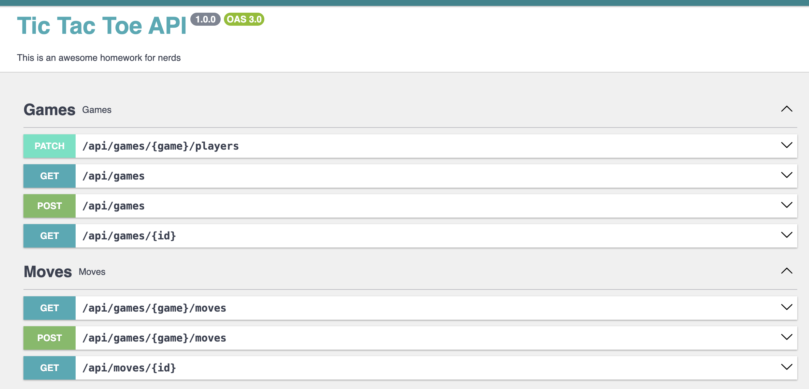
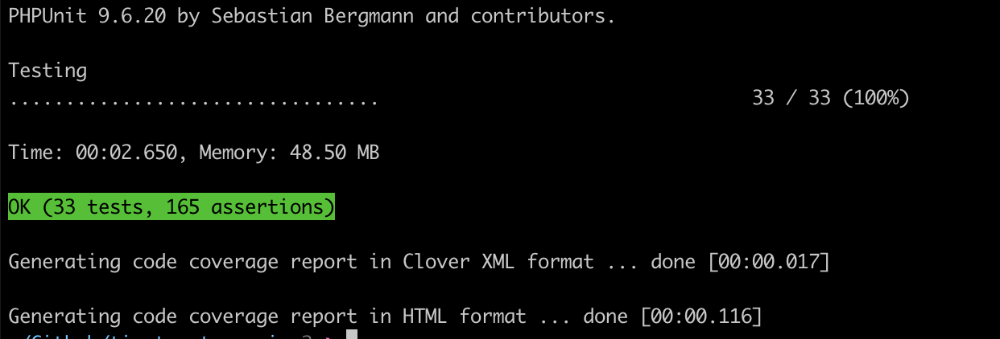

# Tic Tac Toe Game

## Description
This is a simple Tic Tac Toe game that can be played by two players. 
The game is played on a 3x3 grid. 
The players take turns to place their mark (either 'X' or 'O') on the grid. 
The first player to get three of their marks in a row (horizontally, vertically, or diagonally) wins the game. If all the cells on the grid are filled and no player has won, the game ends in a draw.

## Specifications

The backend will be used by a frontend built by a separate team, but they have
provided us with a set of product level requirements that we must meet, exposed as
an API. The requirements are as follows:
1. Need an endpoint to call to start a new game. The response should give me
   some kind of ID for me to use in other endpoints calls to tell the backend what
   game I am referring to.
2. Need an endpoint to call to play a move in the game. The endpoint should take
   as inputs the Game ID (from the first endpoint), a player number (either 1 or 2),
   and the position of the move being played. The response should include a data
   structure with the representation of the full board so that the UI can update
   itself with the latest data on the server. The response should also include a flag
   indicating whether someone has won the game or not and who that winner is if
   so.
3. The endpoint that handles moves being played should perform some basic
   error handling to ensure the move is valid, and that it is the right players turn
   (ie. a player cannot play two moves in a row, or place a piece on top of another
   player’s piece)

## Installation
```bash
  git clone 
  cd tic-tac-toe-api
  composer install
  symfony server:ca:install
```

## Usage
```bash
  symfony serve
  docker-compose up -d
```

## API
Visit http://localhost:8000/api/doc to view the API documentation.




## Test workflow
 - call POST /api/game to start a new game
 - call POST /api/game/{id}/moves to play a move in the game

or use the API documentation to test the endpoints.  
or run the tests using the command below.  

```bash
  php bin/phpunit
```


## Scratchpad Notes

Board [0, 0, 0, 0, 0, 0, 0, 0, 0]:  
    - 3x3 grid  
    - 9 cells  
    - 3 rows  
    - 3 columns  
    - 2 diagonals  

```
1 | 2 | 3
---------
4 | 5 | 6
---------
7 | 8 | 9
```


### Routes:
 - POST /api/game
 - PATCH /api/game/{id}
 - GET /api/game/{id}

 - POST /api/game/{id}/moves
 - GET /api/game/{id}/moves
 - GET /api/game/{id}/moves/{Id}
 